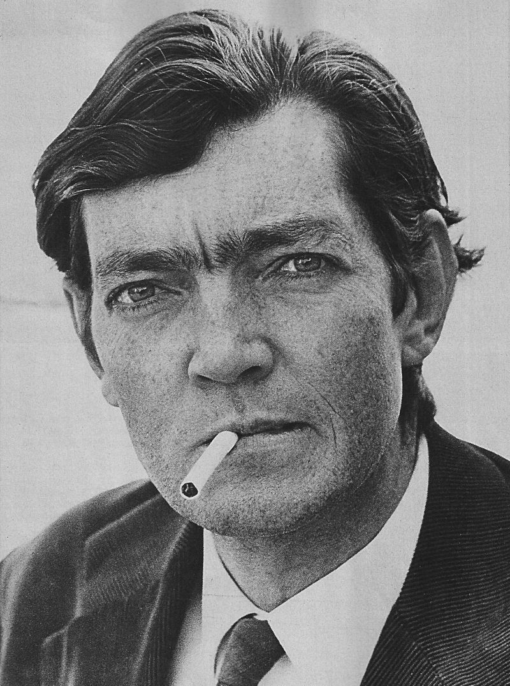
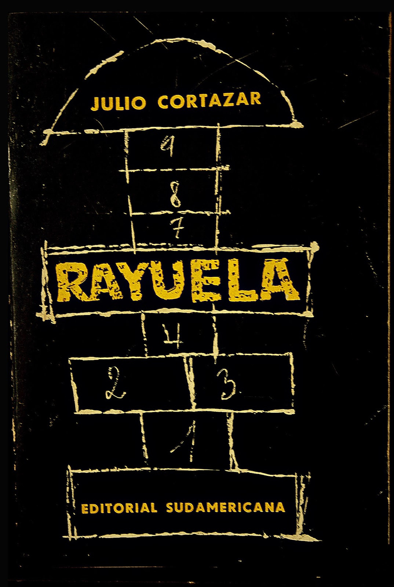
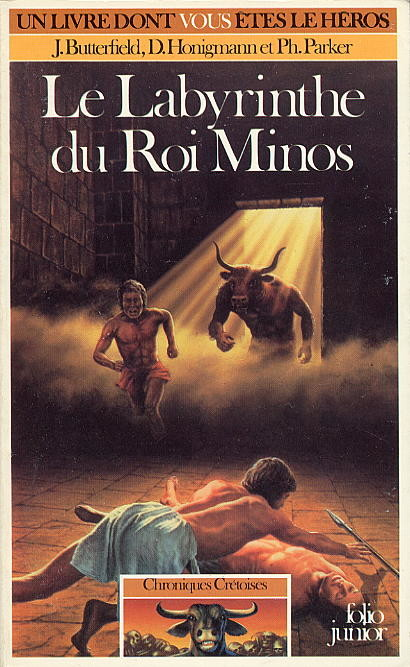
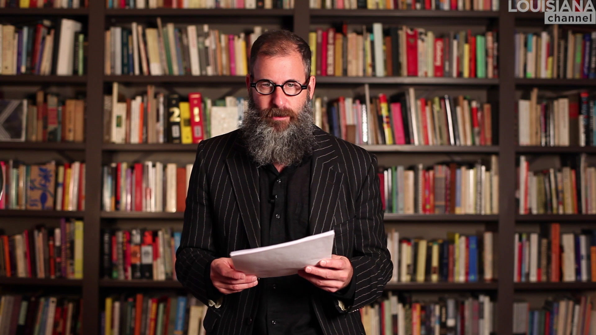

## Hypertextualité. 
Dépassement des contraintes de la linéarité du texte écrit. 
- Non linéarité 
- Serendipité 
- Bifurcations 
- Liens
- Associations

> Nous désignerons par littérature numérique toute forme narrative poétique qui utilise le dispositif informatique comme médium et met en œuvre une ou plusieurs propriétés spécifiques à ce médium.
— Philippe Bootz, [Leonardo/Olats](http://www.olats.org/livresetudes/basiques/litteraturenumerique/1_basiquesLN.php)

[Désordre](http://desordre.net), site conçu et réalisé par Philippe De Jonckheere et Julien Kirch, dans lequel la question des grandes théories de l'information ne sera pas abordée, pas davantage celle de savoir si la photographie est un art à part entière au même titre que la peinture. Il y est parfois question de sexe, de sodomie, de fellation, de gros seins, de pubis et autres joyeusetés, qui font beaucoup de bien aux statistiques du site que nous ne consultons jamais. En revanche nous sommes au regret de vous dire que pas plus que vous nous ne connaissons la recette de l'omelette norvégienne. Le moteur de recherche a un fonctionnement parfaitement erratique et ne vous aidera en rien, au contraire.
+ [Un net désordre,  Pas la peine de crier, Marie Richeux](https://www.franceculture.fr/emissions/pas-la-peine-de-crier/un-net-desordre)
+ [Philippe de Jonckheere – Tentatives d’autoportrait en html, Entretien avec Christèle Couleau et Pascale Hellégouarc’h](https://journals.openedition.org/genesis/518)

L’attracteur de Lorenz est une structure fractale correspondant au comportement à long terme de l'oscillateur de Lorenz. L'attracteur montre comment les différentes variables du système dynamique évoluent dans le temps en une trajectoire non périodique. 
— [fr.wikipedia.org](https://fr.wikipedia.org/wiki/Attracteur_de_Lorenz)

L' « effet papillon » est une expression qui résume une métaphore concernant le phénomène fondamental de sensibilité aux conditions initiales de la théorie du chaos. La formulation exacte qui en est à l'origine fut exprimée par Edward Lorenz lors d'une conférence scientifique en 1972, dont le titre était : « Le battement d'ailes d'un papillon au Brésil peut-il provoquer une tornade au Texas ? »
— [fr.wikipedia.org](https://fr.wikipedia.org/wiki/Effet_papillon)

> À sa façon, ce livre est plusieurs livres mais en particulier deux livres. Le lecteur est invité à choisir entre les deux possibilités suivantes : 
Le premier livre se lit comme se lisent les livres d'habitude et il finit au chapitre 56, là où trois jolies petites étoiles équivalent au mot fin. Après quoi, le lecteur peut laisser tomber sans remords ce qui suit.
Le deuxième livre se lit en commençant au chapitre 73 et en continuant la lecture dans l'ordre indiqué à la fin de chaque chapitre. En cas d'incertitude ou d’oubli il suffira de consulter la liste ci-dessous.
— Julio Cortazar, Marelle

> Désirez-vous connaître l’histoire des trois alertes petits pois ?
— Raymond Queneau, [Conte à votre façon](https://oulipo.net/fr/contraintes/conte-a-votre-facon)

« Recopiez-moi cinq pages »
« Theorize your digital existence.
« Where technology leads, literature follows.
« I used to be an artist ; then I became a poet ; then a writer. Now when asked, I simply refer to myself as a word processor.
« A contemporary poet is someone who doesn’t write poems.
— Kenneth Goldsmith, suite de statuts Facebook.

À propos de *Théorie* de Kenneth Goldsmith, écouter [François Bon](https://www.tierslivre.net/spip/spip.php?article4016)
