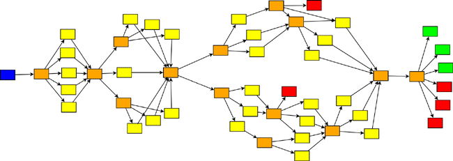
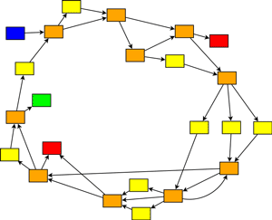

## Outils
* **[Twine](https://twinery.org/)** est un outil open-source pour raconter des histoires interactives et non linéaires. Voir les [tutos vidéos](https://www.youtube.com/playlist?list=PLFGDV4C3TmMGzuRN9In6MQducHbxqwTWI) produits par le studio Tourmaline.
* [txti.es](http://txti.es/) ou [telegra.ph](http://telegra.ph/) sont des espaces de publication anonyme en ligne sans inscription
* [Tumblr](https://www.tumblr.com/), un des nombreux services qui permettent de publier textes, images, sons, vidéos “gratuitement” tout en maîtrisant complètement l’aspect visuel du site
* [Ink](https://www.inklestudios.com/ink/), un langage de balisage pour créer des histoires interactives ou des jeux (principalement) textuels (un peu complexe…)

## Arborescences hypertextuelles

Extraits de [Standard Patterns in Choice-Based Games](https://heterogenoustasks.wordpress.com/2015/01/26/standard-patterns-in-choice-based-games/)

