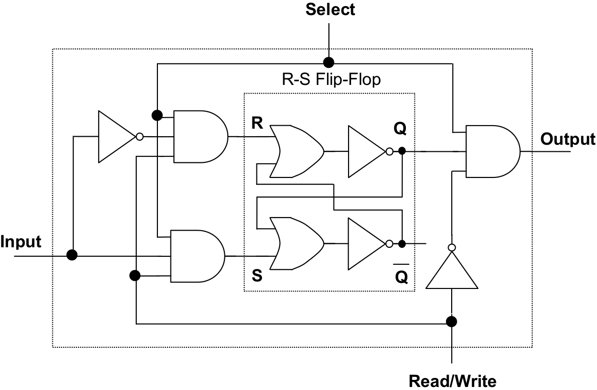

# Living memory

In French, RAM, Random access memory, literally translates to “Living memory”.
In French also, _Mémoire_ is the term for “Master thesis”.

## Context
Read the introduction - _Context_, _Re-enchant_ and _Personal Home Page_ - of the **[Micromedia](https://ateliers-esad--pyrenees-fr.translate.goog/web/pages/projets/micromedia/?_x_tr_sl=fr&_x_tr_tl=en&_x_tr_hl=fr&_x_tr_pto=nui)** project, on which the _Living Memory_ project is based. It is situated in a logic of re-appropriation of digital publication spaces, rejecting submission to pre-constructed tools, canonical forms, standardised templates and private platforms.

[✌ **in french**](?fr)

## Goals

In the process of collecting material and the emergence of your diploma’s project (master’s thesis and plastic project), it is proposed that you put together your research phases, your reflections, experiments, ideas, references, etc., as well as your formal, plastic, graphic and interactive experiments.

This project will act as an augmentation, a complement, an articulation between your thesis and your projects. During the time of the second cycle and your enrolment in the New Media Centre, its realisation will evolve on the principle of a regular publication space, in a free form - as a companion to your projects.

The idea of the Living Memory project is to propose an alternative approach to the traditional notebook, diary or journal, a tool developed to your specifications (tailor-made?), and aware of the importance of the role of new media in the sharing of ideas and forms today.

It will be incremental, hypertextual, moving and evolving, in its forms as in its contents. This evolution will benefit from being documented (an archaeology of the project’s evolution, particularly in terms of form, should be made possible).

## Notions
Maïeutique, hypothèses, corpus, thésaurus, index, taxonomie, fragments, esquisses, énonciation publique
