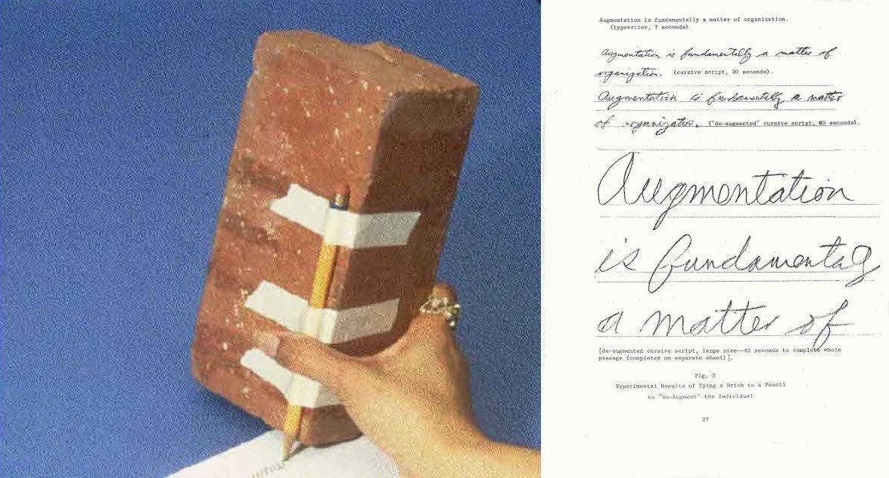
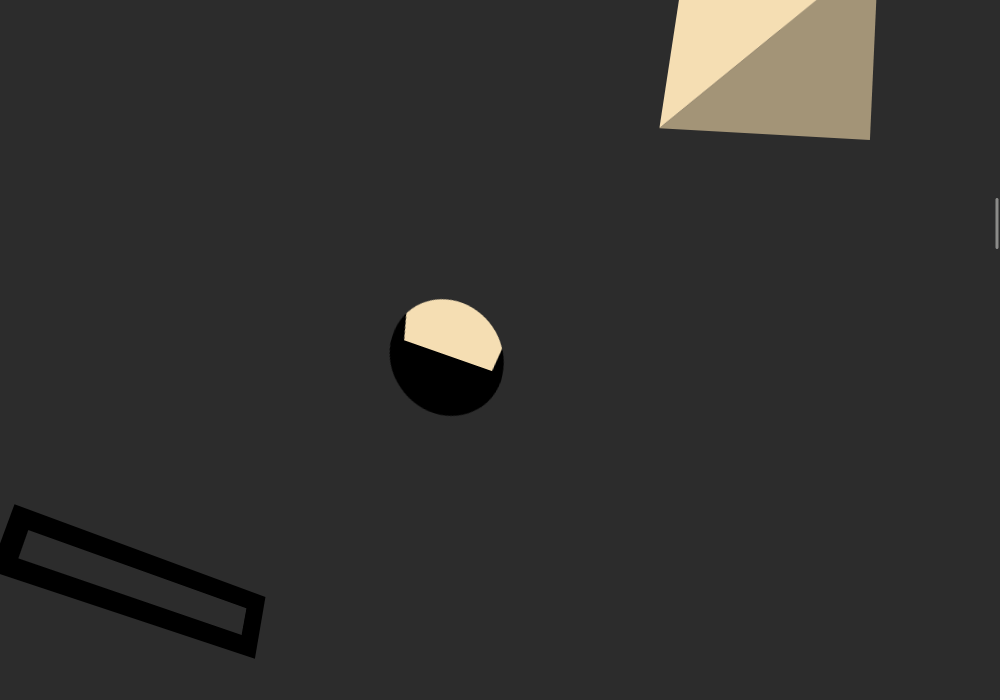
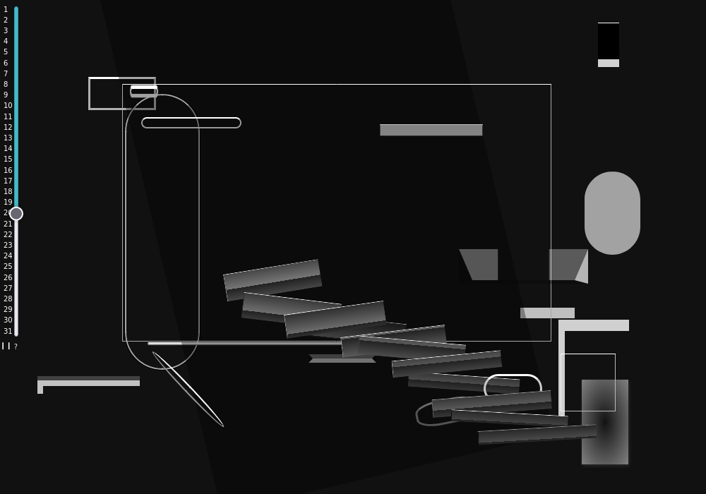
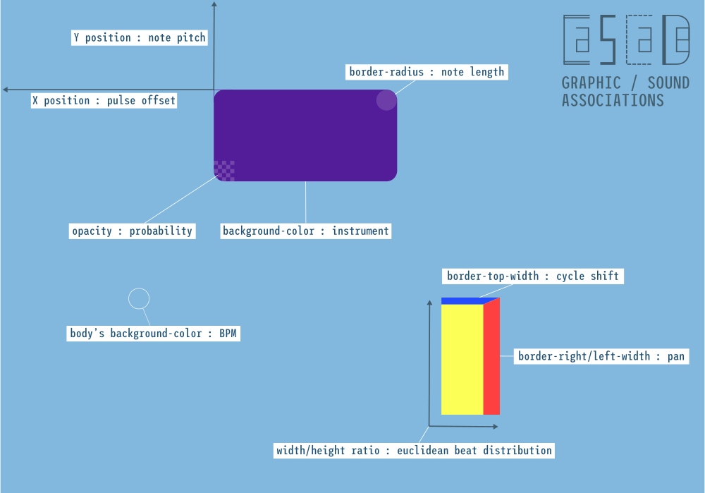
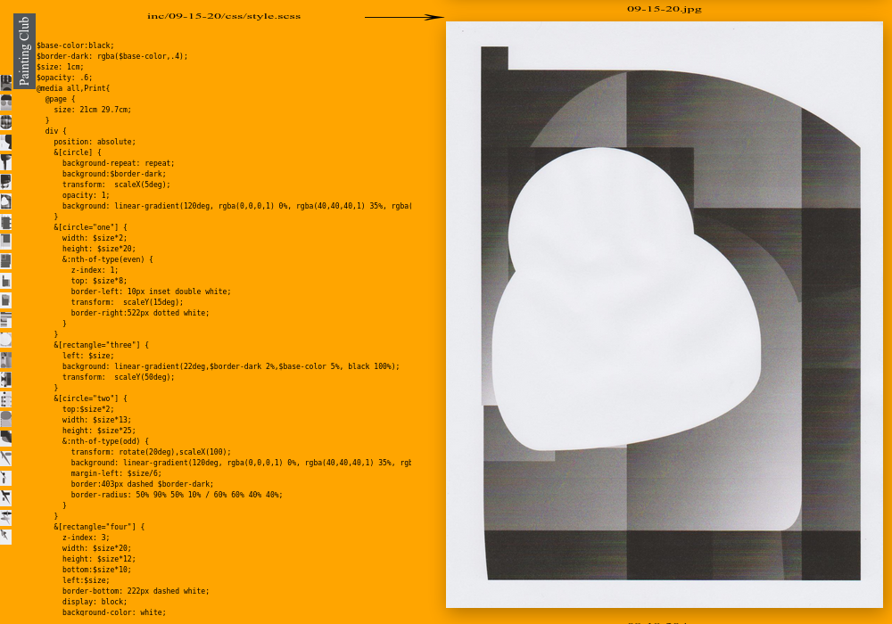
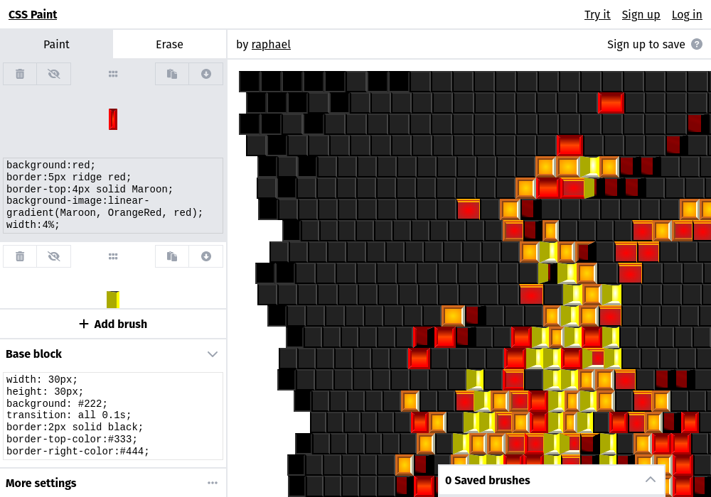
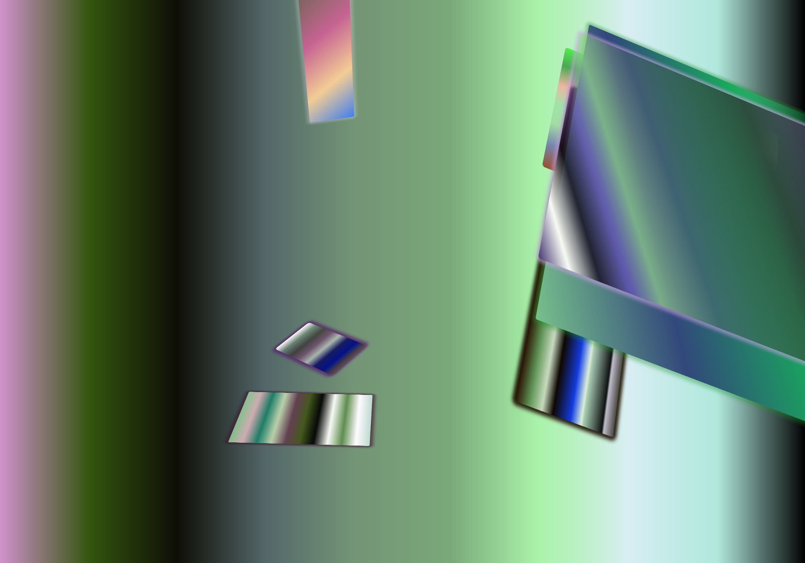
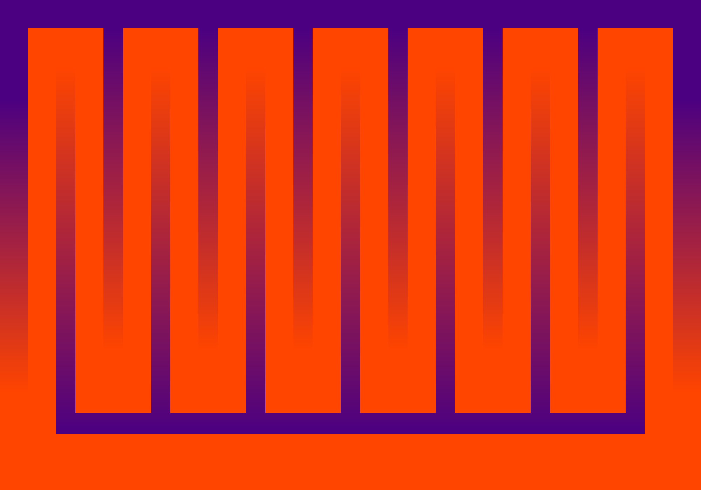

# NeoGeo

## Le choix des ~~armes~~ outils

> We fastened a pencil to a brick and experimented. Figure 2 shows the results, compared with typewriting and ordinary pencil writing. With the brick pencil, we are slower and less precise. If we want to hurry the writing, we have to make it larger. Also, writing the passage twice with the brick-pencil tires the untrained hand and arm.[^doug]

[^doug]: Nous avons fixé un crayon à une brique et avons fait des expériences. La figure 2 montre les résultats, comparés à l’écriture dactylographique et à l’écriture au crayon ordinaire. Avec le crayon-brique, nous sommes moins rapides et précis. Si nous voulons accélérer, nous devons écrire plus grand. De surcroît, le fait d’écrire deux fois le passage avec la brique-crayon fatigue la main et le bras non entraînés. — [source](https://gordonbrander.com/pattern/brick-pencil/)

Les outils avec lesquels nous agissons sur le monde ont une influence sur nos actions. L’usage d’un outil aparemment (voire volontairement) inadapté nous amène à reconsidérer les choix que nous pouvons faire et les formes que nous pouvons produire avec lui.

> <big>« J’aime bien prendre l’exemple des baguettes chinoises. A priori, ça sert à manger. Si tu en fais un truc pour tenir une lampe, tu les détournes de leur finalité d’origine. Eh bien voilà, tu as hacké une paire de baguettes chinoises »[^baguettes]</big>

[^baguettes]: Brian Harvey, cité par Anaëlle Guitton, _Hackers : Au cœur de la résistance numérique_, Paris, Au Diable Vauvert, 2013

## Dessiner et peindre avec CSS

La première vocation du langage CSS n’est évidemment pas d’être un outil de dessin, mais en tordant le langage, en le _hackant_, on peut produire des formes, des couleurs, des ombres, des dégradés, des motifs, bref, dessiner et peindre. 

Parmi les pratiques de dessin avec CSS, certains usages sont vituoses, reproduisant [la Joconde](https://css-art.com/mona-lisa/ ), copiant [les peintres flamants](https://css-art.com/pure-css-lace/) ou [ré-explorant la peinture du XIIe](https://diana-adrianne.com/purecss-francine/) [^francine]. D’autres explorent le champ typographique, dessinant [des lettres](https://refringo.glitch.me/specimen.html), des [alphabets](http://desandro.github.io/curtis-css-typeface/), voire [des systèmes typographiques complets](https://www.loremipsum.ro/fonts/golden-age/). 

Cet usage de CSS est devenu [un exercide de style](https://css-art.com/), poussant la contrainte jusqu’à utiliser [un seul élément HTML](https://a.singlediv.com/), donnant lieu à [un nombre considérable](https://codepen.io/tag/css-art) de démos plus ou moins créatives.

[^francine]: Voir [ce _thread_ twitter](https://twitter.com/waxpancake/status/991412919656005632) dans lequel le projet est soumis aux déformations produites par l’usage d’anciens navigateurs web.

   

* 
Pour where-fears-hi.de, Raphaël Batide a dessiné des [créatures monstrueuses](https://where-fears-hi.de/).

* 
Dans [empathi.cc](https://empathi.cc/), un élément garde les traces des formes qu’il côtoie et rencontre.

* 
Dans [Déclin séquence](https://declin-sequence.neocities.org/) chaque jour du mois d’octobre 2020, 31 éléments HTML `<time>` sont animés en CSS.

* 
[Cascade](https://raphaelbastide.com/cascade/) interprète des pages web en sons, se basant en se basant sur les styles appliqués aux éléments. 

* 
[_Coding from Life_](https://veryinteractive.net/pages/coding-from-life.html) est un projet de Laurel Schwulst, aussi mené par [Mindy Seu](http://designforthe.net/workshops/codingfromlife/index.html) proposant de peindre une nature morte en CSS.

* 
[Painting club](http://painting-club.ivro.fr/) est une proposition de pratique régulière de peinture avec du code, menée par Romain Marula & Ivan Murit.

* 
[CSS Paint](https://css-paint.constraint.systems/) est un outil de Grant Custer qui permet de définir des _brush_ dont le style est dirigé par des règles CSS éditables.

* 
Kim Asendorf, [CSS Compositions](https://kimasendorf.com/css-compositions/), 2014. Composition abstraites de formes et de dégradés.

* 
[Affiches](https://swissincss.com/index.html) du style international (Müller-Brockmann & co.), réinterprétées et animées en CSS par [Jon Yablonski](https://codepen.io/jonyablonski/).

* 
[Fitness](https://leanderherzog.ch/2020/fitness/), Leander Herzog, 2020. Un blob fluide et mouvant animé grace à la propriété CSS `border-radius`.

* 
[Heizig](https://leanderherzog.ch/2017/heizig/), Leander Herzog, 2017. Pure géométrie et dégradé CSS.

* 
[Réinterprétation CSS](https://codepen.io/yuanchuan/full/MQEeJo), d’images issues des posters modernistes japonais d’Ikko Tanaka.

## Outils

### Positions
La propriété CSS `position` peut prendre plusieurs valeurs ([voir la documentation](../../ressources/css/positions/)). Dans le contexte de dessin / peinture en CSS, c’est la valeur `absolute` (et `fixed`) qui seront les plus utiles. Elles permettent de positionner des éléments grâce aux propriétés associées `top`, `right`, `bottom` et `left`, auxquelles on peut attribuer des valeurs en pourcentage, en pixels ou en `vw` et `vh` (unités relatives au_viewport_, la zone visible du navigateur)

**[Exemples](https://codepen.io/esadpyrenees/pen/eYKGGaK)**

### Border-radius et border
La propriété `border-radius` permet de d’arrondir les coins d’un rectangle et le transformer  en une ellipse, un cercle ou une forme ovoïde bizarre.

La propriété `border` peut avoir de nombreux styles : `dotted`, `dashed`, `groove`, `ridge`, `solid`, `outset`, `double`…

**[Exemples](https://codepen.io/esadpyrenees/pen/abKLyyp)**

### Background: Linear gradients
On peut utiliser des dégradés linéaires en tant que `background-image`. On peut déterminer son point de départ et son angle, puis on détermine les couleurs et leurs positions.

**[Exemples](https://codepen.io/esadpyrenees/pen/zYaEdyw)**

Le site [cssgradient.io](https://cssgradient.io/) propose un générateur de dégradés ainsi que de [nombreux dégradés prédéfinis](https://cssgradient.io/gradient-backgrounds/).

### Background: Radial gradients
On peut utiliser des dégradés radiaux en tant que `background-image`. On détermine son centre, on peut définir sa taille, puis on détermine les couleurs et leurs positions.

**[Exemples](https://codepen.io/esadpyrenees/pen/MWXEEgb)**

Le site [cssgradient.io](https://cssgradient.io/) propose aussi de générer des dégradés radiaux.

### Background: Conic gradients
On peut utiliser des dégradés coniques (les transitions entre les couleurs ont lieu autour d’un centre plutôt que depuis le centre). On détermine son centre, on peut définir sa taille, puis on détermine les couleurs et leurs positions.

**[Exemples](https://codepen.io/esadpyrenees/pen/PoaJJKo)**

Le site [cssgradient.io](https://cssgradient.io/) propose aussi de générer des dégradés radiaux.

### Background: Repeating gradient

Les dégradés linéaires ou radiaux peuvent être répétés pour générer des motifs, grâce aux propriétés d’arrière-plan `repeating-linear-gradient` et `repeating-radial-gradient` ou aux possibilités de dimensionnement des images d’arrière plan proposées par `background-size`.

**[Exemples](https://codepen.io/esadpyrenees/pen/LYrzzRJ)**

Le site [magicpatterns.design](https://www.magicpattern.design/tools/css-backgrounds) ou [Léa Vérou](https://projects.verou.me/css3patterns/) proposent un certain nombre de motifs basés sur ces possibilités.

### Multiple backgrounds
Un élément peut avoir plusieurs arrières-plans. Les propriétés de dégradés doivent être séparées par des virgules. Les exemples ci-dessous n’utilisent que les dégradés précédemment évoqués mais on peut également utiliser des images (png, jpg, svg, gif) multiples en tant qu’arrières-plans.

**[Exemples](https://codepen.io/esadpyrenees/pen/BaVwmoW)**

### Transformations

Les transformations CSS sont [documentées ici](http://localhost/web/pages/ressources/css/transformations/). Elles permettent d’affecter aux éléments des rotations, des inclinaisons, des mises à l’échelle ou des translations.

**[Exemples](https://codepen.io/esadpyrenees/pen/XWYezaQ)**

### Variables et calculs

Grâce à `calc`, il est possible de réaliser des calculs pour déterminer la valeur d'une propriété CSS. On peut l’utiliser en écrivant `width: calc(100% - 60px)`.

Notamment en conjonction avec `calc`, les variables CSS (ou _propriétés personnalisées_) sont un moyen très puissant pour affecter des valeurs et les réutiliser dans un document. Elles sont initialisées grâce à la notation `--ma-variable: 20px;` et sont accessibles en utilisant la notation `var(--ma-variable)`.

**[Exemples](https://codepen.io/esadpyrenees/pen/mdKBqLW)**

<!--
### Shapes
### Clip paths

# Outils et frameworks
https://css-doodle.com/
https://yuanchuan.dev/talk/generative-art-with-css/

-->
