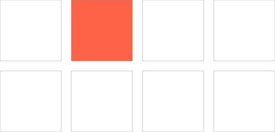
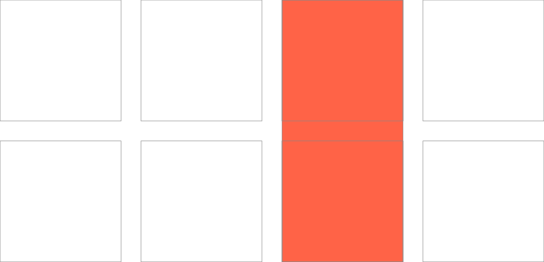
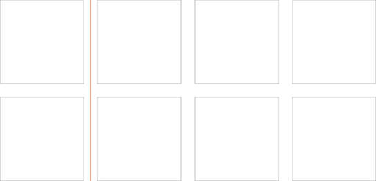

# CSS Grid layout
<style>
img {max-width: 300px}
</style>

*Grid layout* est le module CSS dédié à la mise en page.
Il est apparu après des années de bricolage ou furent utilisées des techniques parfois approximatives souvent complexes et contre-intuitives (tables, floats, inline-blocks).

Il diffère de [Flexbox](../flexbox) principalement par le fait qu’il est dédié à des *layouts* bi-dimensionnels (lignes **et** colonnes), là où flexbox est dédié aux layouts uni-dimensionnels (lignes **ou** colonnes).

Au delà de ceux qui sont présents dans cette page, voir **[quelques exemples](../../../exemples/#grid)**.


# Démarrer

On crée un “contexte de grille” en appliquant la déclaration `display: grid` à un élément HTML. 
```css
.container { display: grid; }
```
Cette déclaration va permettre de définir un ensemble de pistes, formées de lignes et de colonnes, définissant des “cellules”.

```css
.container { 
  display: grid; 
  grid-template-columns: 1fr 1fr 1fr; /* définit explicitement une grille de trois colonnes */
  grid-template-rows: repeat(3, 1fr); /* définit explicitement  une grille de trois lignes, avec "repeat()" */
}
```

Cet ensemble “virtuel” de lignes et de colonnes va permettre aux enfants de ce conteneur de devenir des `grid-items` qui seront positionnées au sein des cellules de la grille.

On peut souhaiter déterminer une goutière (un espace entre les lignes et colonnes) :

```css
.container { 
  display: grid; 
  gap: 1em; /* espace uniforme ou bien: */
  gap: 1em 2em; /* espace de 2em entre les colonnes, 1em entre les lignes */
}
```
⚠ Lorsque des images sont insérées dans une grille, il est souvent (toujours…) nécessaire de les dimensionner pour qu’elles ne dépassent pas de la largeur de la cellule (voir [les règles à systématiser](../reset/)) :

```css
.container img { 
  max-width: 100%; /* pour ne pas les agrandir mais uniquement les rétrécir */
  width: 100%; /* pour forcer leur redimensionnement */
}
```


## Flexibilité

CSS Grid introduit des unités plus complexes que les habituels `px`, `%`, `em`, qui permettent notamment de s'adapter à la taille des contenus et d’aporter beaucoup de flexibilité à la mise en page.

| Unité     | Détails     |
| :------------- | :------------- |
| `fr`  | fraction(s) de l'espace restant |
| `min-content`  | se rapporte à la largeur (ou hauteur) de l'élément le plus petit |
| `max-content`  | se rapporte à la largeur (ou hauteur) de l'élément le plus grand |
| `minmax(min, max)`  | exemple `minmax(min-content, 20%)` correspond à largeur 20% (ou hauteur), mais au  minimum largeur (ou hauteur) du contenu |
| `auto`  | s'adapte à la largeur (ou hauteur) du contenu |


## Implicite _vs_ explicite

Il est souvent souhaitable de laisser le navigateur déterminer le nombre de lignes (voire même de colonnes) nécessaires pour afficher les enfants d’une grille dans ses cellules.

Plutôt que la déclaration ci-dessus, on préférera parfois utiliser celle-ci :

```css
.container { 
  display: grid; 
  gap:.5em;
  /* autant de colonnes que possible (auto-fill), dont la largeur est au minimum 300px */
  grid-template-columns: repeat(auto-fill, minmax(300px, 1fr)); 
  /* on ne définit pas de lignes, le navigateur en créera autant que nécessaire */
}
```

<div resizable class="intrinsic ex">
  <p>1</p>
  <p>2</p>
  <p>3</p>
  <p>4</p>
  <p>5</p>
  <p>6</p> 
</div>

## Positionnement des éléments

Les éléments d’une grille peuvent être explicitement affectés à une cellule.

```html
<body>
  <header>header</header>
  <nav>nav</nav>
  <article>article</article>
  <aside>aside</aside>
</body>
```
```css
body {
    display: grid; /* crée une grille */
    grid-template-columns: 150px 1fr; /* crée deux colonnes */
    grid-template-rows: 100px 200px; /* crée deux lignes */
}
header {
    grid-row: 1; grid-column: 1; /* ligne 1, colonne 1 */
}
nav {
    grid-row: 1; grid-column: 2; /* ligne 1, colonne 2 */
}
article {
    grid-row: 2; grid-column: 2; /* ligne 2, colonne 2 */
}
aside {
    grid-row: 2; grid-column: 1; /* ligne 2, colonne 1 */
}
```
<div class="ex ex2">
  <header>header</header>
  <nav>nav</nav>
  <article>article</article>
  <aside>aside</aside>
</div>

Mais on peut également (c’est souvent préférable) laisser le navigateur « faire au mieux » en donnant aux éléments le moins possible de règles : 

#### En spécifiant uniquement le nombre de colonnes ou de lignes qu’un élément doit occuper :
```css
.item-2 { grid-column-end: span 3; }
.item-11 { grid-column: 3 / span 3; }
.item-14 { grid-row-end: span 2; }
```
<div class="ex ex2bis">
  <div class=""></div>  
  <div class="div2"> <code>grid-column-end: span 3</code></div>  
  <div class=""></div>  
  <div class=""></div>  
  <div class=""></div>  
  <div class=""></div>  
  <div class=""></div>  
  <div class=""></div>  
  <div class=""></div> 
  <div class=""></div>  
  <div class="div11"><code>grid-column: 3 / span 3</code></div>  
  <div class="div12"><code>grid-row-end: span 2;</code></div>  
  <div class=""></div>  
  <div class=""></div>  
  <div class=""></div>  
  <div class=""></div> 
  <div class=""></div>  
  <div class=""></div>  
  <div class=""></div>  
  <div class=""></div>  
  <div class=""></div>  
  <div class=""></div>  
</div>


#### En spécifiant uniquement la colonne ou la ligne à laquelle un élément doit débuter :
```css
.item-2 { grid-column: 3; }
.item-13 { grid-row: 2; }
```
<div class="ex ex3bis">
  <div class=""></div>  
  <div class="div32"> <code>grid-column: 3</code></div>  
  <div class=""></div>  
  <div class=""></div>  
  <div class=""></div>  
  <div class=""></div>  
  <div class=""></div>  
  <div class=""></div>  
  <div class=""></div> 
  <div class=""></div>  
  <div class=""></div>  
  <div class=""></div>  
  <div class="div314"><code>grid-row: 2;</code></div>  
  <div class=""></div>  
  <div class=""></div>  
  <div class=""></div> 
  <div class=""></div>  
  <div class=""></div>  
  <div class=""></div>  
  <div class=""></div>  
  <div class=""></div>  
  <div class=""></div>  
</div>

↑ Ici, la deuxième cellule est laissée vide, l’élément sensé l’occuper étant positionné explicitement en 3<sup>e</sup> colonne. Le 13<sup>e</sup> élément, positionné explicitement sur la 2<sup>e</sup> ligne, occupe sa première place.

↓ On peut “densifier” une grille, en forçant ses enfants à occuper le plus de cellules disponibles :

```css
.grille {
  /* … */
  grid-auto-flow: dense;
}
```
<div class="ex ex3bis dense">
  <div class=""></div>  
  <div class="div32"> <code>grid-column: 3</code></div>  
  <div class="">👋</div>  
  <div class=""></div>  
  <div class=""></div>  
  <div class=""></div>  
  <div class=""></div>  
  <div class=""></div>  
  <div class=""></div> 
  <div class=""></div>  
  <div class=""></div>  
  <div class=""></div>  
  <div class="div314"><code>grid-row: 2;</code></div>  
  <div class=""></div>  
  <div class=""></div>  
  <div class=""></div> 
  <div class=""></div>  
  <div class=""></div>  
  <div class=""></div>  
  <div class=""></div>  
  <div class=""></div>  
  <div class=""></div>  
</div>


## Zones nommées

En complément de `grid-template-columns` et de `grid-template-rows`, on peut **nommer** les emplacements à l’aide de chaines de caractères  ou de lettres, grâce à la propriété `grid-template-areas`.
```css
section {
    display: grid;
    grid-template-columns: 150px 1fr;
    grid-template-rows: 60px 300px 100px;
    grid-template-areas: "entete entete"
                         "navigation contenu"
                         "pied pied";
}
header { grid-area: entete; /* placement de <header> dans l'emplacement "entete" */ }
nav { grid-area: navigation; /* placement de <nav> dans l'emplacement “navigation” */ }
article { grid-area: contenu; /* placement de <article> dans l'emplacement "contenu" */ }
footer { grid-area: pied; /* placement de <footer> dans l'emplacement "pied" */ }

/* une media-query permet ici de positionner différemment les éléments */
@media (max-width:40em) {
  section {
    grid-template-columns: min-content 1fr;
    grid-template-areas: "entete navigation" 
                         "contenu contenu" 
                         "pied pied";
  }
}

```
<div class="zones-container" >
<div class="zones ex3 ex" >
  <header>header</header>
  <article>article</article>
  <nav>nav</nav>
  <footer>footer</footer>
</div>
</div>


## Ressources en ligne

Le plus éclairant des tutoriels et guides sur CSS Grid est sans doute celui de Josh W. Comeau : [**An Interactive Guide to CSS Grid**](https://www.joshwcomeau.com/css/interactive-guide-to-grid/).

De très nombreuses ressources sont disponibles en ligne : [Gridbyexample.com](https://gridbyexample.com/examples/), les grilles, par l’exemple… ; *Visual cheat sheet*, [toutes les propriétés, illustrées](http://grid.malven.co/) ; [CSS Grid Cheat Sheet](https://alialaa.github.io/css-grid-cheat-sheet/), *your ultimate CSS grid visual guide* ; [☞ Layoutland](https://www.youtube.com/layoutland), les vidéos éclairantes de Jen Simmons ; [_Grid experiments_](https://codepen.io/search/pens?q=grid+experiment) sur Codepen…

Quelques autres liens :

### Tutoriaux complets

*   [CSS Grid Layout, guide complet](https://la-cascade.io/css-grid-layout-guide-complet/), La Cascade, (fr)
*   [Les bases](https://developer.mozilla.org/fr/docs/Web/CSS/CSS_Grid_Layout), sur Mozilla Developper Network (fr)
*   [CSS3 Grid Layout](https://www.alsacreations.com/article/lire/1388-css3-grid-layout.html), sur Alsacreations (fr)

### Examples

*   [gridbyexample.com](https://gridbyexample.com/examples/), les grilles, par l’exemple…
*   [CSS Grid Cheat Sheet](https://alialaa.github.io/css-grid-cheat-sheet/), your ultimate CSS grid visual guide


### Vocabulaire

Quelques précisions de vocabulaire sur les notions essentielles nécessaires à la compréhension de Grid layout.


<div class="gridlist vocabulary" markdown="1">

- #### Conteneur (*container*)
  
  Le conteneur qui contient la totalité de la grille CSS. 

- #### Élément (*grid item*)
  
  Tout élément qui est l’enfant direct d’un conteneur de grille.

- #### Cellule (*cell*)
  
  Une seule unité d’une grille CSS.

- #### Piste (*track*)
  
  L’espace horizontal ou vertical entre deux lignes de la grille.

- #### Colonne (*column*)
  
  Une piste verticale d’une grille.

- #### Rangée (*row*)
  
  Une piste horizontale d’une grille.

- #### Gouttière (*gutter*)
  
  L’espace entre les lignes et les colonnes dans une grille.

- #### Ligne (*line*)
  
  Les lignes (*lines*) verticales et horizontales qui divisent la grille et en colonnes (*columns*) et en lignes (*rows*).

- #### Zone (*area*)
  
  Un espace rectangulaire déterminé par quatre lignes.  
  
</div>